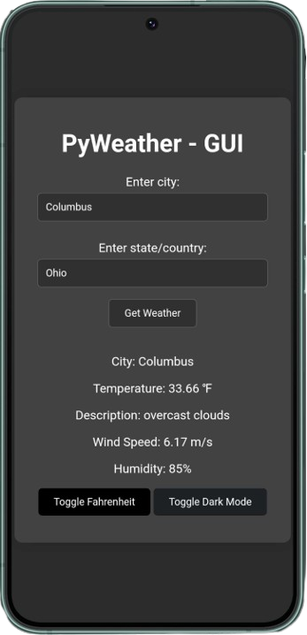

PyWeather, is a free & piece of open source software, that uses the OpenWeatherMap API to retrieve weather information from user input
Now with a gui! 

---

---

---

---
# Prerequisites  
Python
Requests (pip install requests)

---
# Setup - CLI

Simply create a api key from the following link: https://home.openweathermap.org/api_keys

paste it in @ line 38

and you are done!

---

# Setup - GUI

Simply use any webserver client (exp SiPyWeb) also works on nginx, run it and it should work. already has a free public api key installed!
and/or you can of course make your own api key: https://home.openweathermap.org/api_keys
If you are running on nginx windows, just download our zip file from releases, extract it, and run nginx.exe!

---

# if you want to skip this, download the public file already containing an api key! 
https://github.com/colebolebole/openweather/releases/tag/pyweather

